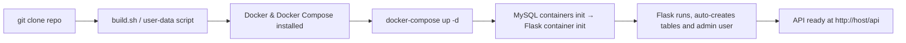
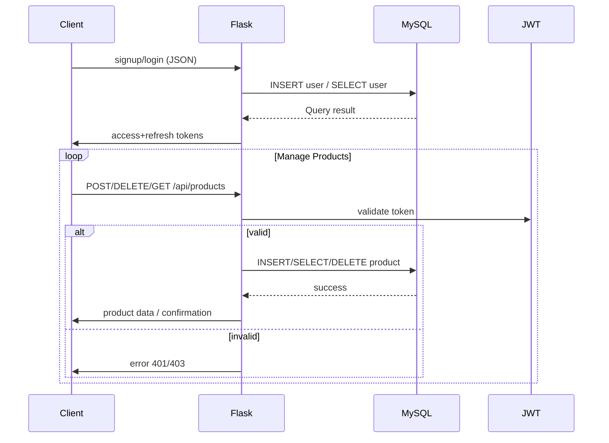

# 🗂️ Project Overview

A Flask-based **catalog microservice** in a Docker Compose multi-container setup, featuring:

* **Flask REST API** for users and products
* **MySQL** for persistent data
* **JWT auth**
* **Infrastructure via Docker Compose** and optional reverse proxy

---

## 1. 🚀 Setup & Deployment

### Components:

* `Dockerfile` – defines Flask app container
* `docker-compose.yml` – orchestrates `app`, `mysql`, and `nginx` (or similar)
* `.env` – environment variables:

  ```env
  DATABASE_URL = mysql+pymysql://<USER>:<PASS>@mysql:3306/catalog
  JWT_SECRET_KEY = <secret>
  ```
* `build.sh` / `user-data.sh` – automated setup for CI/CD / server provisioning

### Deployment Flow:



---

## 2. 🧩 Architecture Diagram

```
┌───────────────┐       Docker Compose       ┌───────────────┐
│  User Client  │ ───────HTTP(S)───────▶ │  Flask App     │
└───────────────┘                        │  (catalog)     │
                                          └─────┬─────────┘
                                                │
                                 SQLAlchemy ORM │
                                                ▼
                                          ┌──────────────┐
                                          │   MySQL      │
                                          │  (catalogdb) │
                                          └──────────────┘
```

---

## 3. 🔐 Authentication Flow

1. **POST** `/api/auth/signup` → creates user, hashes password, saves to DB.
2. **POST** `/api/auth/login` → verifies credentials, returns JWT `access_token` + `refresh_token`.
3. **GET** `/api/auth/refresh` → uses refresh token to issue new access token.
4. **Protected endpoints** (like product creation/deletion) require the JWT in `Authorization` header.

---

## 4. 📦 API Endpoints

### Auth

* `POST /api/auth/signup`
  → Request: `{username, email, password}`
  → Response: `{id, username, email, access_token, refresh_token}`

* `POST /api/auth/login`
  → Request: `{username, password}`
  → Response: `{access_token, refresh_token, user}`

* `POST /api/auth/refresh`
  → Protected by refresh token → returns new access token

### Products

* `GET /api/products` – Retrieve all products
* `GET /api/products/my` – List products owned by authenticated user
* `POST /api/products` – Create new product `{ name, price, description }`
* `DELETE /api/products/<id>` – Delete owned product only

---

## 5. 📊 Data Model

### User Table

| Column         | Type        | Notes                   |
| -------------- | ----------- | ----------------------- |
| id             | Integer PK  |                         |
| username       | String(80)  | Unique, not null        |
| email          | String(120) | Unique, not null        |
| password\_hash | Text        | Storing hashed password |

### Product Table

| Column      | Type        | Notes                |
| ----------- | ----------- | -------------------- |
| id          | Integer PK  |                      |
| name        | String(512) | Not null             |
| description | Text        |                      |
| price       | Float       | Not null             |
| user\_id    | Integer FK  | References `User.id` |

**Relations:**

* One-to-many: `User` → `Products`

---

## 6. 🔁 Control/Data Flow



---

## 7. ✅ Advantages & Next Steps

* **Modular design**: easy to extend/apply for microservices
* **Containerized with Docker Compose**, return quickly replicable stacks
* **JWT-based security**, safe and stateless
* **Future improvements**:

  * Add **Flask-Migrate** (Alembic) for migrations
  * Improve security (rate limiting, input sanitization)
  * Add **logging/monitoring** (e.g., Prometheus + Grafana)
  * Scale via Docker Swarm / Kubernetes
  * Add an API spec (OpenAPI/Swagger) and auto-generate client docs

---

### ✅ Proposed Documentation File Structure

```
docs/
├── overview.md         # Summary + architecture
├── api_endpoints.md    # Endpoint list + request/response examples
├── data_model.md       # ER diagrams + schema
├── deployment.md       # Docker setup + user-data
├── sequence_flows.md   # Diagrams & flowcharts
```

---
