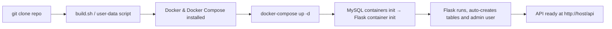
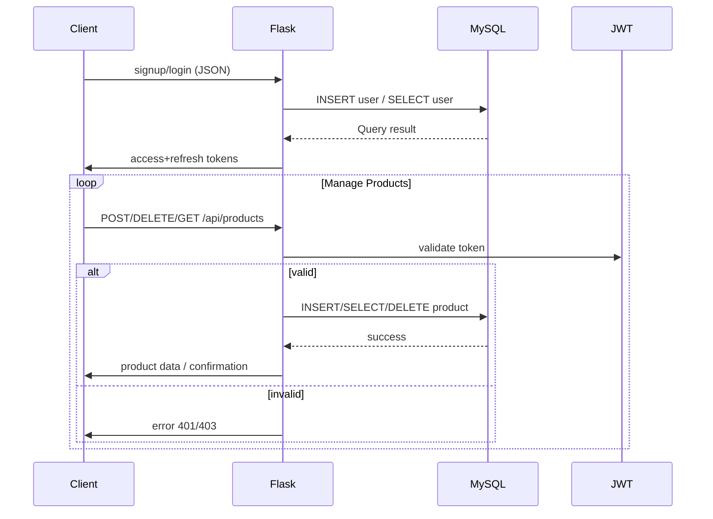

# 🗂️ Project Overview

A Flask-based **catalog microservice** in a Docker Compose multi-container setup, featuring:


* **Flask REST API** for users and products
* **MySQL** for persistent data
* **JWT auth**
* **Nginx Reverse Proxy**
* **Infrastructure via Docker Compose** and optional reverse proxy

---

## 1. 🚀 Setup & Deployment

### Components:

* `Dockerfile` – defines Flask app container
* `docker-compose.yml` – orchestrates `app`, `mysql`, and `nginx proxy` 
* `.env` – environment variables:

  ```env
  DATABASE_URL = mysql+pymysql://<USER>:<PASS>@mysql:3306/catalog
  JWT_SECRET_KEY = <secret>
  ```
* `user-data.sh` – automated setup for server provisioning


---

### Deployment Flow:



---

## 2. 🧩 Architecture Diagram

```
┌───────────────┐       Docker Compose       ┌───────────────┐
│  User Client  │ ───────HTTP(S)───────▶ │  Flask App     │
└───────────────┘                        │  (catalog)     │
                                          └─────┬─────────┘
                                                │
                                 SQLAlchemy ORM │
                                                ▼
                                          ┌──────────────┐
                                          │   MySQL      │
                                          │  (catalogdb) │
                                          └──────────────┘
```

---

## 3. 🔐 Authentication Flow

1. **POST** `/api/auth/signup` → creates user, hashes password, saves to DB.
2. **POST** `/api/auth/login` → verifies credentials, returns JWT `access_token` + `refresh_token`.
3. **GET** `/api/auth/refresh` → uses refresh token to issue new access token.
4. **Protected endpoints** (like product creation/deletion) require the JWT in `Authorization` header.

---

## 4. 📦 API Endpoints

### Auth

* `POST /api/auth/signup`
  → Request: `{username, email, password}`
  → Response: `{id, username, email, access_token, refresh_token}`

* `POST /api/auth/login`
  → Request: `{username, password}`
  → Response: `{access_token, refresh_token, user}`

* `POST /api/auth/refresh`
  → Protected by refresh token → returns new access token

### Products

* `GET /api/products` – Retrieve all products
* `GET /api/products/my` – List products owned by authenticated user
* `POST /api/products` – Create new product `{ name, price, description }`
* `DELETE /api/products/<id>` – Delete owned product only

---

## 5. 📊 Data Model

### User Table

| Column         | Type        | Notes                   |
| -------------- | ----------- | ----------------------- |
| id             | Integer PK  |                         |
| username       | String(80)  | Unique, not null        |
| email          | String(120) | Unique, not null        |
| password\_hash | Text        | Storing hashed password |

### Product Table

| Column      | Type        | Notes                |
| ----------- | ----------- | -------------------- |
| id          | Integer PK  |                      |
| name        | String(512) | Not null             |
| description | Text        |                      |
| price       | Float       | Not null             |
| user\_id    | Integer FK  | References `User.id` |

**Relations:**

* One-to-many: `User` → `Products`

---

## 6. 🔁 Control/Data Flow




## 7. ✅ `user-data.sh`: EC2 Provisioning Script

This script automates provisioning of an Ubuntu-based EC2 instance with:

* Docker & Docker Compose
* App environment variables
* App code pulled from GitHub
* Docker Compose deployment

```bash
#!/bin/bash
set -e
exec > >(tee -a /var/log/user-data.log) 2>&1

# --- Update and install Docker & Docker Compose ---
apt-get update -y
apt-get install -y \
    docker.io \
    git \
    curl

# Enable Docker service
systemctl start docker
systemctl enable docker

# Install Docker Compose (v2 plugin-style)
DOCKER_COMPOSE_VERSION="v2.24.2"
mkdir -p /usr/local/lib/docker/cli-plugins
curl -SL https://github.com/docker/compose/releases/download/${DOCKER_COMPOSE_VERSION}/docker-compose-linux-x86_64 -o /usr/local/lib/docker/cli-plugins/docker-compose
chmod +x /usr/local/lib/docker/cli-plugins/docker-compose

# --- Set environment variables (Replace these if passed dynamically or injected via EC2 UserData) ---
DB_NAME="${db_name}"
DB_USER="${db_user}"
DB_PASS="${db_password}"
DATABASE_URL="${db_url}"
jwt_secret_key="${jwt_secret_key}"

# --- Clone the application code ---
cd /home/ubuntu
git clone https://github.com/guderian120/catalog-server-repo.git
cd catalog-server-repo

# --- Inject .env file for Docker Compose ---
cat <<EOF > .env
DATABASE_URL="$DATABASE_URL"
JWT_SECRET_KEY="$jwt_secret_key"
EOF

# --- Launch the application ---
docker compose up -d
```

---

## 🔧 Explanation of EC2 Bootstrap Setup

The **`user-data.sh`** script is designed for one-time initialization of a freshly launched EC2 instance. Here's what it does step by step:

### 1. 🐳 Docker + Docker Compose Setup

Installs:

* `docker.io`: Core container runtime
* `docker-compose`: Required to manage multi-container apps
* `git` & `curl`: For fetching code and binaries

### 2. 📁 GitHub Code Deployment

Clones the Flask catalog microservice repository directly to the instance:

```
https://github.com/guderian120/catalog-server-repo.git
```

### 3. 🔐 Environment Variables Injection

Generates a `.env` file dynamically with variables such as:

```env
DATABASE_URL=mysql+pymysql://<USER>:<PASS>@mysql:3306/catalog
JWT_SECRET_KEY=<secret>
```

These are consumed by the Flask app and Docker Compose setup.

### 4. 📦 Application Launch

Runs:

```bash
docker compose up -d
```

This spins up all defined containers (Flask app, MySQL, Nginx) in the background.

---

## 📌 Important Notes

* Ensure the EC2 instance uses a **security group** that allows HTTP (80) or HTTPS (443), and optionally SSH (22).
* Instance should have sufficient storage (\~8–10 GB) for Docker layers.
* Use **Elastic IP** for consistent external access.
* You can inject dynamic values into the script using EC2 parameter store or dynamic templates (e.g., Terraform).

---
### Workflow
```
┌────────────────────────────┐
│       Terraform/DevOps     │
│  (Launch EC2 with script)  │
└────────────┬───────────────┘
             │
             ▼
┌────────────────────────────┐
│        EC2 Instance        │
│ (Ubuntu-based, public IP)  │
└────────────┬───────────────┘
             │
             │   ┌──────────────────────────────────────────────┐
             └──▶│  Step 1: Install Docker, Git, and Curl       │
                 └──────────────────────────────────────────────┘
                        │
                        ▼
                 ┌──────────────────────────────────────────────┐
                 │  Step 2: Install Docker Compose (v2 plugin)   │
                 └──────────────────────────────────────────────┘
                        │
                        ▼
                 ┌──────────────────────────────────────────────┐
                 │  Step 3: Clone GitHub repo to /home/ubuntu    │
                 │  URL: github.com/guderian120/catalog-server…  │
                 └──────────────────────────────────────────────┘
                        │
                        ▼
                 ┌──────────────────────────────────────────────┐
                 │  Step 4: Generate .env file dynamically       │
                 │  from injected UserData variables             │
                 └──────────────────────────────────────────────┘
                        │
                        ▼
                 ┌──────────────────────────────────────────────┐
                 │  Step 5: Launch app with Docker Compose       │
                 │  Containers: Flask App, MySQL, Nginx Proxy    │
                 └──────────────────────────────────────────────┘
                        │
                        ▼
                ┌────────────────────────────┐
                │  Accessible via Public IP  │
                │ (e.g., http://EC2_PUBLIC_IP) │
                └────────────────────────────┘

```


## 8. ✅ Advantages & Next Steps

* **Modular design**: easy to extend/apply for microservices
* **Containerized with Docker Compose**, return quickly replicable stacks
* **JWT-based security**, safe and stateless
* **Future improvements**:

  * Add **Flask-Migrate** (Alembic) for migrations
  * Improve security (rate limiting, input sanitization)
  * Add **logging/monitoring** (e.g., Prometheus + Grafana)
  * Scale via Docker Swarm / Kubernetes
  * Add an API spec (OpenAPI/Swagger) and auto-generate client docs

---


